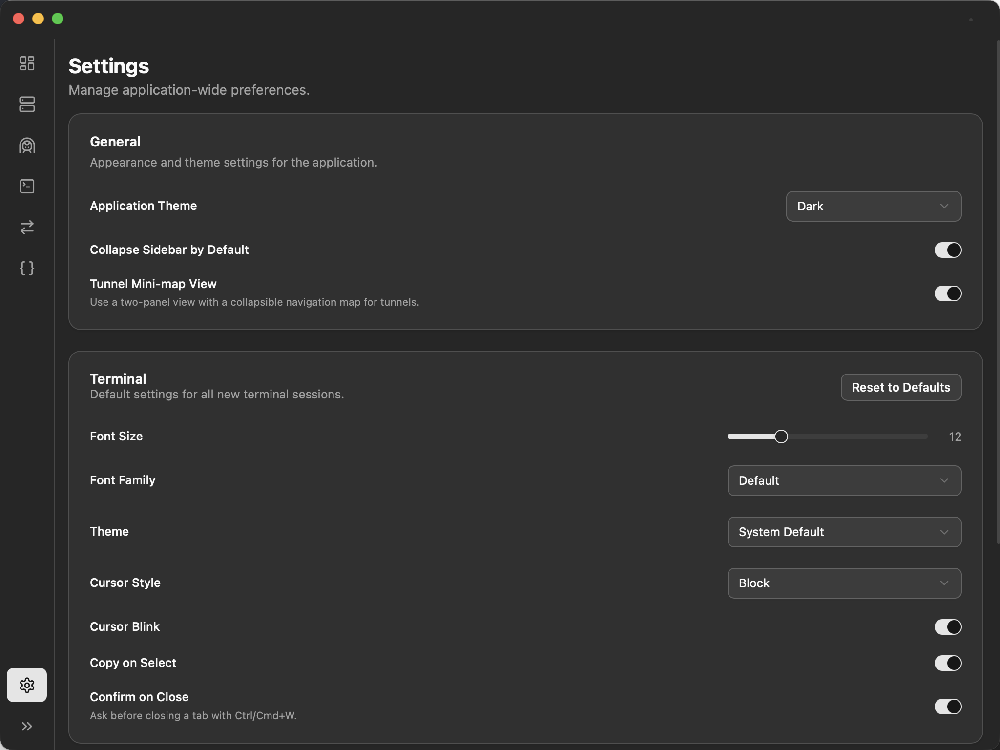

# DevTools: Your Development Assistant

This document is available in multiple languages, including [English](README.md) and [Chinese](README_zh.md).

**DevTools** is an all-in-one, highly integrated desktop application designed for modern developers. It consolidates essential daily tools into a unified, beautiful, and efficient interface, aiming to reduce context switching and let you focus on what truly matters: coding.

## ✨ Core Features

### 1. Dashboard

An overview of your workspace. See all active SSH tunnels and file sync tasks at a glance, and quickly launch favorite connections or create new tunnels.

### 2. SSH Gate

Say goodbye to the hassle of manually editing `~/.ssh/config`.

- **Visual Editor**: Manage all your SSH hosts in an intuitive list format, making it easy to add, edit, or delete.
- **Raw File Editing**: For advanced users, we still provide a powerful raw text editor with syntax highlighting.
- **One-Click Connect**: Launch an internal or external terminal session directly from the list.

### 3. Tunnels

A powerful and easy-to-use SSH tunnel manager, perfect for remote development and accessing internal networks.

- **Create & Save**: Easily configure local and remote port forwarding and save them for one-click startup in the future.
- **Smart Start**: Before launching a tunnel, the application automatically handles interactive authentication for SSH key passphrases or server passwords, without needing to pre-configure `ssh-agent`.
- **Status Monitoring**: View the real-time status, uptime, and port mappings of all active tunnels.
- **Drag & Drop Sorting**: Organize your saved tunnels according to your preference.

### 4. Integrated Terminals

A full-featured, multi-tab terminal optimized for SSH sessions.

- **Multi-Session Management**: Open and manage multiple SSH sessions in different tabs.
- **Status Indicators**: Clearly see the connection status of each terminal (connecting, connected, disconnected).
- **Easy Reconnect**: Reconnect to a disconnected session with a single click.
- **Custom Naming**: Rename your terminal sessions for easy identification.

### 5. File Syncer

Keep files and directories in real-time sync between your local machine and remote hosts. Set up "watchers" to monitor file changes and automatically sync them to the destination, with detailed synchronization logs.

### 6. JSON Tools

A built-in JSON viewer and formatter that supports syntax highlighting, formatting, minifying, and validation, making it a great assistant for handling API responses and configuration files.

### 7. Settings

- **Theme**: Supports Light, Dark, and System-default theme modes.
- **UI Scaling**: Freely adjust the interface size according to your screen and preferences for a more comfortable visual experience.
- **Hotkeys**: Set hotkeys for the terminal.

## 🚀 Tech Stack

- **Backend**: Go
- **Frontend**: React, TypeScript, Tailwind CSS
- **Desktop App Framework**: Wails
- **UI Component Library**: shadcn/ui
- **State Management**: Zustand (useSettingsStore)
- **Core Libraries**: xterm.js (for the terminal)

## 💡 Design Philosophy

We noticed that many developers have to switch back and forth between multiple separate applications (like terminals, SSH clients, tunnel tools) to complete their daily work. The core philosophy of DevTools is **integration and simplification**.

By seamlessly integrating core functions like SSH, tunnels, and terminals, we aim to reduce the mental load and time wasted by developers, thereby enhancing focus and productivity. At the same time, we place extreme importance on performance and user experience. From the "smart refresh" mechanism on the frontend (to avoid unnecessary component re-renders) to the efficient Go language implementation on the backend, every detail has been carefully polished to ensure the application's responsiveness and stability.

## 🛠️ Installation and Usage

Visit our Releases page to download the latest version for your operating system.

## 🤝 Contributing

We welcome all forms of contributions! If you have a great idea or have found a bug, please feel free to submit an Issue or Pull Request.

For information on how to set up a local development environment, please refer to our Development Guide.

## Snapshots

## About
