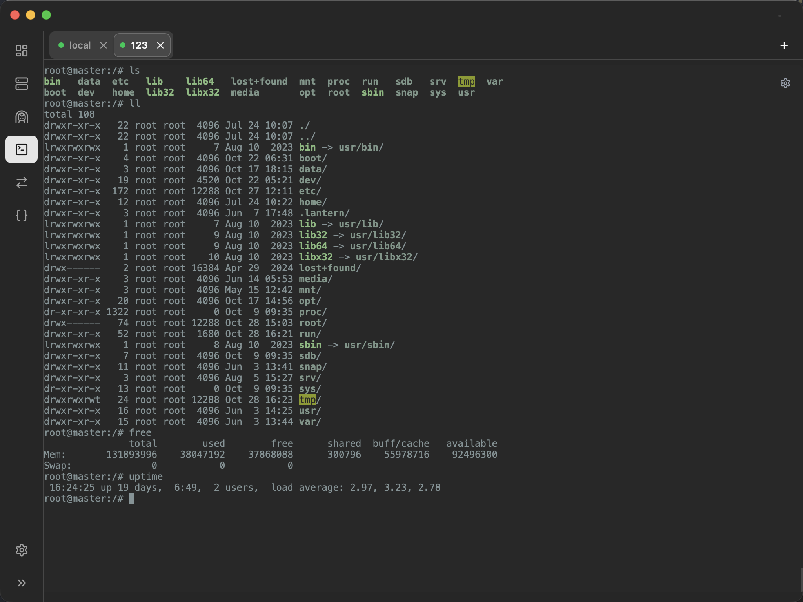

# DevTools: 开发助手

本文档提供多语言版本，包括[英文](README.md)和[中文](README_zh.md)

**DevTools** 是一款专为现代开发者设计的、功能高度集成的一站式桌面应用。将日常所需的核心工具整合至一个统一、美观且高效的界面中，旨在减少上下文切换，让您专注于真正重要的编码工作。

## ✨ 核心功能

### 1. 仪表盘 (Dashboard)

工作区概览。一目了然地查看所有活动的 SSH 隧道、文件同步任务，并可快速启动常用连接或创建新隧道。

### 2. SSH 网关 (SSH Gate)

告别手动编辑 `~/.ssh/config` 的繁琐。

- **可视化编辑器**：以直观的列表形式管理您的所有 SSH 主机，轻松添加、编辑或删除。
- **原始文件编辑**：对于高级用户，我们依然提供功能强大的原始文本编辑器，并支持语法高亮。
- **一键连接**：直接从列表中启动一个内部或外部的终端会话。

### 3. 隧道管理 (Tunnels)

强大而易用的 SSH 隧道管理器，是远程开发和内网穿透的利器。

- **创建与保存**：轻松配置本地和远程端口转发，并将其保存以备将来一键启动。
- **智能启动**：在启动隧道前，应用会自动处理 SSH 密钥密码或服务器密码的交互式验证，无需预先配置 `ssh-agent`。
- **状态监控**：实时查看所有活动隧道的状态、运行时长和端口映射。
- **拖拽排序**：按您的偏好对保存的隧道进行排序。

### 4. 集成终端 (Terminals)

一个功能完备的多标签终端，专为 SSH 会话优化。

- **多会话管理**：在不同的标签页中打开和管理多个 SSH 会话。
- **状态指示器**：清晰地看到每个终端的连接状态（连接中、已连接、已断开）。
- **轻松重连**：一键重新连接已断开的会话。
- **自定义命名**：为您的终端会话重命名，方便识别。

### 5. 文件同步器 (File Syncer)

在本地和远程主机之间保持文件和目录的实时同步。设置 "watcher" 来监控文件变更，并自动将它们同步到目标位置，并提供详细的同步日志。

### 6. JSON 工具 (JSON Tools)

内置的 JSON 查看器和格式化工具，支持语法高亮、格式化、压缩和校验，是处理 API 响应和配置文件的得力助手。

### 7. 个性化设置 (Settings)

- **主题**：支持亮色、暗色和跟随系统三种主题模式。
- **UI 缩放**：根据您的屏幕和偏好，自由调整界面大小，提供更舒适的视觉体验。
- **快捷键**：设置 terminal 的快捷键。

## 🚀 技术栈

- **后端**: Go
- **前端**: React, TypeScript, Tailwind CSS
- **桌面应用框架**: Wails
- **UI 组件库**: shadcn/ui
- **状态管理**: Zustand (useSettingsStore)
- **核心库**: xterm.js (用于终端)

## 💡 设计理念

我们注意到，许多开发者不得不在多个独立的应用程序（如终端、SSH 客户端、隧道工具）之间来回切换以完成日常工作。DevTools 的核心理念就是**整合与简化**。

通过将 SSH、隧道、终端等核心功能无缝集成，我们旨在减少开发者的心智负担和时间浪费，提升专注度和生产力。同时，我们极度注重性能和用户体验。从前端的“智能刷新”机制（避免不必要的组件重载）到后端高效的 Go 语言实现，每一个细节都经过精心打磨，确保应用的响应速度和稳定性。

## 🛠️ 安装与使用

访问我们的 Releases 页面 下载适用于您操作系统的最新版本。

## 🤝 贡献

我们欢迎任何形式的贡献！如果您有好的想法或发现了 Bug，请随时提交 Issue 或 Pull Request。

有关如何设置本地开发环境，请参阅我们的 [开发指南](./development_guide_zh.md)。

## 快照

