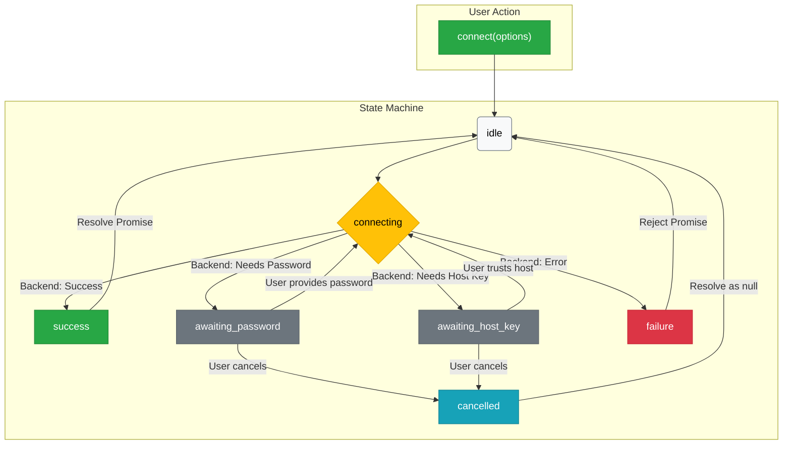
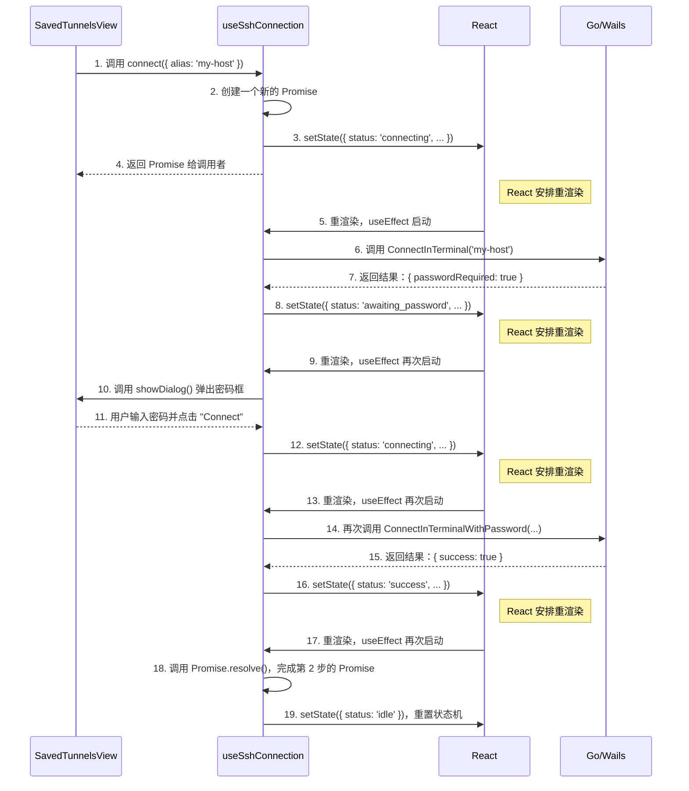

# `useSshConnection` Hook 深度解析

`useSshConnection` 是一个用于处理 SSH 连接全流程的自定义 Hook。

> 它通过将复杂的、多步骤的异步交互（如密码输入、主机密钥验证）封装成一个可复用的、基于状态机的逻辑单元，极大地简化了组件代码。

## 1. 核心思想：状态机 (State Machine)

理解这个 Hook 的关键，在于理解它是一个**有限状态机 (Finite State Machine, FSM)**。

- **`useState` 作为状态存储**: Hook 使用 `useState` 来存储状态机的**当前状态**。例如，是“空闲” (`idle`)，还是正在“连接中” (`connecting`)，或是“等待密码输入” (`awaiting_password`)。
- **`useEffect` 作为状态引擎**: Hook 使用 `useEffect` 来监听**状态的变化**。当状态从 `A` 变为 `B` 时，`useEffect` 会被触发，并执行状态 `B` 对应的逻辑（比如，当状态变为 `awaiting_password` 时，就弹出密码输入框）。
- **`connect` 函数作为触发器**: `connect` 函数是暴露给外部的唯一接口。它本身不执行复杂的连接逻辑，它的唯一作用就是将状态机的初始状态从 `'idle'` 切换为 `'connecting'`，从而**启动**整个状态机引擎。

## 2. 状态机定义 (`ConnectionState`)

这个 Hook 定义了以下几种可能的状态：

- **`idle`**: 初始状态和最终状态。表示当前没有任何连接操作。
- **`connecting`**: 核心处理状态。表示正在与后端通信，尝试建立连接。所有异步逻辑（调用 Wails 函数）都在这个状态下执行。
- **`awaiting_password`**: 等待用户输入。当后端返回“需要密码”时进入此状态。
- **`awaiting_host_key`**: 等待用户确认。当后端返回“需要验证主机密钥”时进入此状态。
- **`success`**: 成功状态。表示整个连接流程成功完成。
- **`failure`**: 失败状态。表示流程中出现任何错误。
- **`cancelled`**: 取消状态。当用户在交互对话框中点击“取消”时进入此状态。

## 3. 状态流转图

下面是状态之间如何流转的可视化表示：

## 4. 执行流程详解

让我们以一次需要输入密码的连接为例，来追踪整个执行流程：

### 流程文字解释

1. **触发 (Trigger)**:
   - `SavedTunnelsView` 组件中的事件处理器（如 `handleStart`）调用从 Hook 中获取的 `connect` 函数。

2. **启动状态机 (Initiation)**:
   - `connect` 函数内部做的第一件事，就是创建一个新的 `Promise`。这个 Promise 的 `resolve` 和 `reject` 函数被保存起来。
   - 然后，它调用 `setState({ status: 'connecting', ... })`，将状态机的开关拨到“连接中”。
   - 最后，它将刚刚创建的 `Promise` 返回给 `handleStart`。`handleStart` 中的 `toast.promise` 或 `await` 就会等待这个 Promise 的结果。

3. **引擎运转 (`useEffect`)**:
   - `setState` 调用触发了组件的重渲染。
   - 重渲染完成后，`useEffect` 被执行。它检查到当前 `state.status` 是 `'connecting'`，于是进入 `case 'connecting':` 分支。
   - 它调用后端的 Wails 函数（如 `ConnectInTerminal`）。

4. **状态流转 (Transition)**:
   - 后端函数返回结果。`useEffect` 根据返回结果，再次调用 `setState`，将状态切换到下一个阶段（比如 `'awaiting_password'` 或 `'success'`）。
   - 这个新的 `setState` 又会触发一次重渲染，`useEffect` 又会再次被执行，处理新状态的逻辑。

5. **循环往复**:
   - 这个 “`setState` -> 重渲染 -> `useEffect` -> 执行逻辑 -> `setState`” 的循环会一直持续，直到状态变为一个**终结状态**（`success`, `failure`, `cancelled`）。

6. **终结与重置 (Termination & Reset)**:
   - 当状态变为 `success`, `failure` 或 `cancelled` 时，`useEffect` 会执行相应的分支。
   - 在这些分支里，它会调用最初保存的 `resolve` 或 `reject` 函数，来终结第 2 步中创建的那个 `Promise`。
   - 最后，它会调用 `setState({ status: 'idle' })`，将状态机重置回“空闲”状态，为下一次调用做好准备。

## 5. 关键设计模式

- **关注点分离 (Separation of Concerns)**: `connect` 函数只负责“启动”，而 `useEffect` 只负责“执行”。这使得代码逻辑非常清晰。
- **Promise 封装**: 将整个复杂、多步骤的异步流程封装成一个单一的 `Promise`，为调用者提供了极其简洁的接口。
- **上下文传递 (`context` 对象)**: 像 `resolve`, `reject`, `alias` 这些需要在多个状态之间共享的数据，被统一放在 `context` 对象中，随着状态流转而传递。

希望这篇文档能帮助您彻底理解 `useSshConnection` Hook 的精妙之处！
