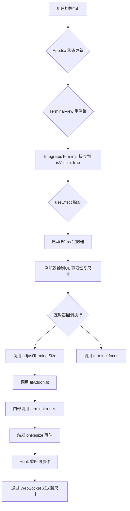
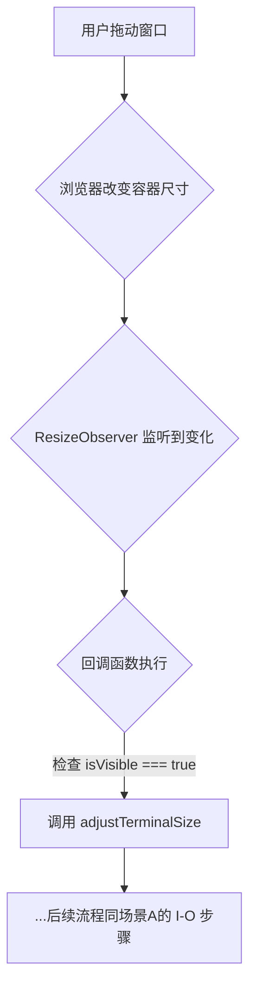

# React 重构笔记：揭秘 IntegratedTerminal 中尺寸自适应与焦点管理的“时序之舞”

本文档旨在深入解析 `IntegratedTerminal` 组件中一个非常微妙、但也极其重要的前端难题：当 React 的渲染生命周期与浏览器的异步 `ResizeObserver` API 交互时，如何确保终端尺寸和焦点状态的正确性。

## 1. 核心目标与挑战

`IntegratedTerminal` 组件的核心目标是：**确保一个 XTerm.js 终端实例在任何时候都完美地填充其父容器的尺寸。**

这听起来简单，但挑战在于：

- 当终端所在的 Tab 被隐藏时，它的容器尺寸会变为 0x0。
- 当 Tab 切换回来时，我们需要在容器恢复尺寸后，**立即**告诉终端去重新计算自己的行列数。
- 当浏览器窗口大小改变时，我们也需要终端能实时响应。

## 2. 谜题：来自控制台的“矛盾”日志

在调试过程中，我们观察到了一段极其“诡异”的日志输出。当打开第二个终端 Tab 时，第一个（现在应该被隐藏）终端实例打印出了如下日志：

```text
// 1. React 首先执行 effect，报告 isVisible 已经变为 false
[...]<local> [useEffect] visible: false

// 2. 但紧接着，ResizeObserver 的回调却执行了，并报告 isVisible 依然是 true！
[...]<local> [ResizeObserver]FitAddon resize... visible: true ...
```

这个看似矛盾的现象，完美地揭示了现代浏览器和 React 之间精妙的“时序之舞”。

## 3. 深度解析：“渲染”与“观察”的异步鸿沟

1. **React 的“渲染”阶段 (同步)**:
   - 当你打开第二个 Tab 时，`App.tsx` 的 state 更新，触发了一次**同步**的重渲染。
   - 在这次渲染中，第一个 `<IntegratedTerminal>` 实例接收到的 `isVisible` prop **立即**变成了 `false`。
   - React 执行了第一个终端的 `useEffect`，此时 `isVisible` 的值是 `false`，因此打印出了第一条日志。
   - React 将 DOM 更新（例如，为第一个终端的容器添加 `display: none`）提交给浏览器。

2. **浏览器的“绘制”阶段 (异步)**:
   - 浏览器接收到 DOM 更新，将第一个终端的容器从屏幕上移除，使其尺寸变为 `0x0`。这个过程发生在另一个微任务或宏任务中。

3. **`ResizeObserver` 的“观察”阶段 (异步)**:
   - **`ResizeObserver` 的回调函数，被设计为在浏览器完成“绘制”之后，才异步地、批量地执行**。
   - 当它最终被触发时（因为它观察到了尺寸从有到无的变化），它执行的，是我们**上一次**（`isVisible` 还是 `true` 时）渲染 `IntegratedTerminal` 组件时，在 `useEffect` 中**定义**的那个回调函数。
   - **问题的核心：陈旧的闭包 (Stale Closure)**。在那个**旧的**回调函数的“闭包”里，`isVisible` 这个变量的值，依然是它被定义时的那个值——**`true`**！
   - **结果**: `ResizeObserver` 在一个**新的**绘制周期（尺寸已变为0）中，执行了一个**旧的**函数（它记忆中的 `isVisible` 还是 `true`）。这就导致了你在日志中看到的那个精准但矛盾的输出。

## 4. 从“时序之舞”到“UI之殇”：Bug 的连锁反应

理解了这个底层原理，就能解释遇到的所有 Bug 了。

- **Bug #1: 终端在被隐藏时，尺寸意外缩小**
  正是因为那个带有“陈旧” `isVisible: true` 状态的 `ResizeObserver` 回调，在一个尺寸已经变为 0 的容器上，错误地调用了 `fitAddon.fit()`，导致终端被重置为了一个极小的尺寸。

- **Bug #2: 切换回来后，终端“吞字”且显示不完整**
  当你切换回这个 Tab 时，虽然我们的 `useEffect` 会因为 `isVisible` 变为 `true` 而再次调用 `fitAddon.fit()`，但终端的内部状态可能已经因为上一次错误的 `fit` 而变得混乱，导致无法完全恢复。

## 5. 终极解决方案：带“守卫”的观察与主动校准

最终方案通过“被动观察+主动校准”的组合，完美地解决了所有这些问题。

### 场景 A：用户切换到此终端 Tab (`isVisible` 从 `false` 变为 `true`)



**关键点解读**：

- **为何需要 `setTimeout`?** 因为 React 的渲染和浏览器的绘制是异步的。在 `useEffect` 运行时，`isVisible` 已经是 `true` 了，但 DOM 容器可能还没来得及在屏幕上真正“撑开”。延迟 50ms 是为了确保在调用 `.fit()` 时，容器已经有了稳定的、非零的尺寸。
- **为何需要 `terminal.focus()`?** 确保用户切换回来后，可以直接在终端里输入，无需再次手动点击。

### 场景 B：用户拖动浏览器窗口大小 (当此 Tab 可见时)



**关键点解读**：

- `ResizeObserver` 是我们响应窗口尺寸变化的主力。它保证了无论用户如何拖动窗口，终端都能实时适配。

### 代码实现

```tsx
// file: frontend/src/components/ssh-gate/IntegratedTerminal.tsx

// 场景B: 响应容器尺寸变化 (被动观察)
useEffect(() => {
  const resizeObserver = new ResizeObserver(() => {
    // 关键守卫：只有当组件可见时，才执行 fit
    if (isVisible) {
      void adjustTerminalSize()
    }
  })
  // ... 观察容器 ...
}, [isVisible, adjustTerminalSize])

// 场景A: 响应可见性变化 (主动校准)
useEffect(() => {
  if (isVisible) {
    // 延迟执行，确保容器的 CSS (display: block) 已经应用完毕
    const timer = setTimeout(() => {
      // 1. 重新计算尺寸，解决“吞字”和宽度不正确的问题
      void adjustTerminalSize()
      // 2. 将键盘焦点设置到终端上，解决无法输入和需要再次点击的问题
      if (terminal) {
        terminal.focus()
      }
    }, 50)
    return () => clearTimeout(timer)
  }
}, [isVisible, terminal, adjustTerminalSize])
```
